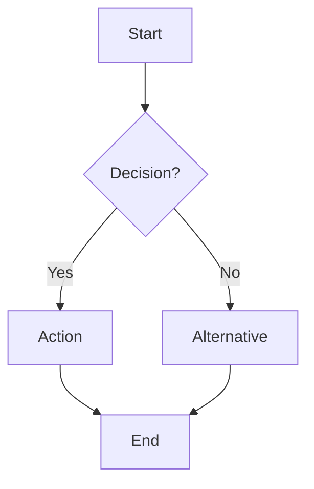
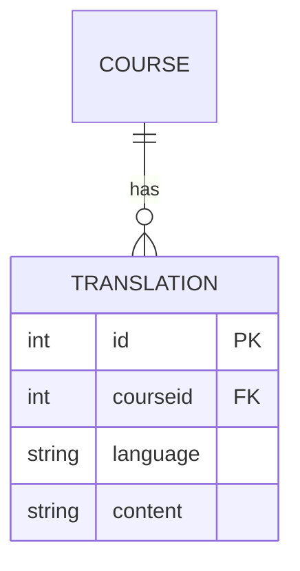

# Specs — [FRANKENSTYLE]

> **Status:** Template. Fill `intent.md` in first — this file picks up where that one ends.

## Overview

Carried over from [`intent.md`](intent.md) once that file is done.

**What problem does this plugin solve?**
- [Fill in main purpose — carried over from intent.md]

**Target users:**
- [Student / Teacher / Manager / Other roles — carried over from intent.md]

---

## Features (MVP)

- [ ] Feature 1 — [description]
- [ ] Feature 2 — [description]
- [ ] Feature 3 — [description]

---

## User Stories & Test Scenarios

See [`user-stories.md`](user-stories.md) — a separate file, since it stays live during build and test (a progress table per scenario), while this file is done once the build starts.

---

## User Flows

### Flow 1: [Name]

---

## Data Model

---

## Capabilities

| Capability | Description | Default roles |
|---|---|---|
| `[FRANKENSTYLE]:view` | [description] | [roles] |
| `[FRANKENSTYLE]:create` | [description] | [roles] |
| `[FRANKENSTYLE]:manage` | [description] | [roles] |

---

## Out of Scope

- [What won't this plugin do?]
- [External dependencies excluded]

---

## Testing Strategy

- **PHPUnit tests:** [What logic needs testing?]
- **Behat scenarios:** [What user workflows need testing?]

Concrete test scenarios (Given/When/Then) and their progress live in [`user-stories.md`](user-stories.md), not here.

